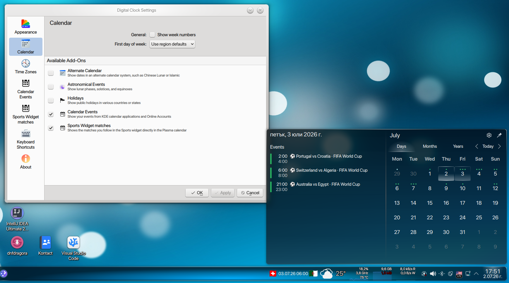
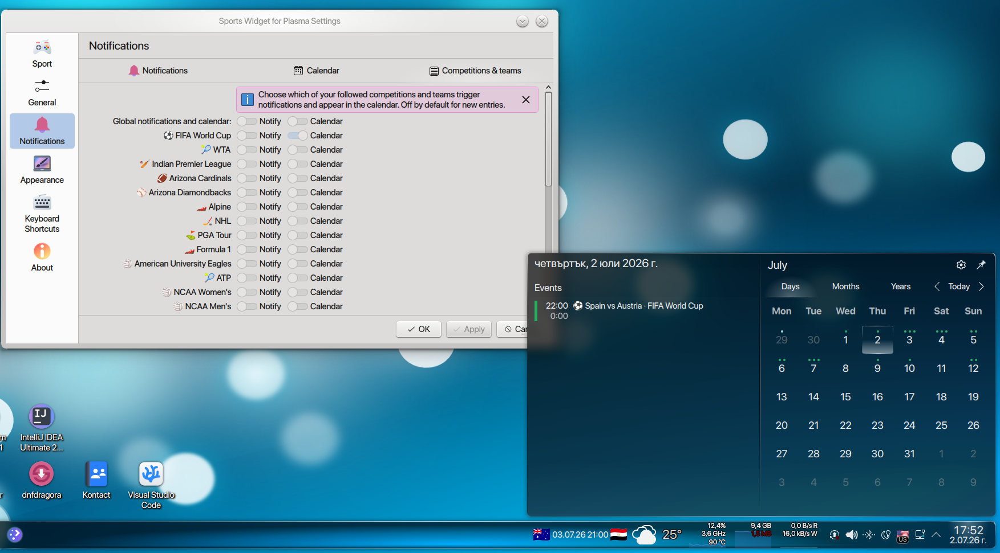
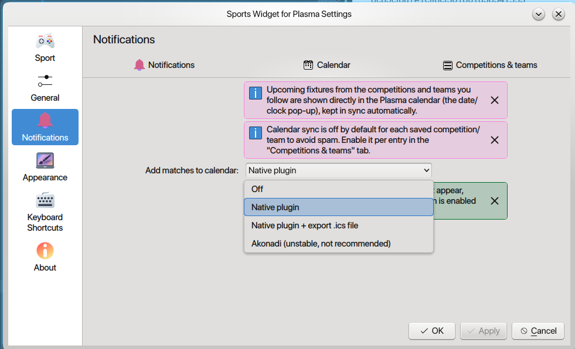

# Sports Widget - Plasma calendar plugin

This is a small native **Plasma calendar-events plugin** that shows the matches you follow in the Sports widget directly in the Plasma calendar (the date/clock pop-up).

## Download & install

Download the plugin archive:

https://github.com/pnedyalkov91/sports-widget-for-plasma/raw/main/plugin/sports-calendar-plugin.tar.gz

Note: Before installing, please verify the downloaded archive's MD5 checksum matches:
8cb3cf8a7e1cff8cf501861d38341553 

```sh
tar -xzf sports-calendar-plugin.tar.gz
cd <extracted folder>
sh install.sh
```

Then restart Plasma and enable **"Sports Widget matches"** under right-click the Digital Clock -> Configure ->  Calendar. Finally, enable the calendar option in the widget
settings (Notifications -> Calendar), which also shows whether this plugin is
detected.

**1. Enable the plugin in the Digital Clock settings:**



**2. Enable calendar sync in the widget settings:**





If you want to uninstall it, please run:

```sh
sh uninstall.sh
```

## Files

- `sportsmatchesevents.h` / `.cpp` - the plugin implementation.
- `SportsMatchesEventsConfig.qml` - the config page shown in Plasma calendar settings.
- `metadata.json` - plugin metadata (embedded into the `.so`).
- `install.sh` - installs the plugin + config QML.
- `uninstall.sh` - removes the installed plugin and disables it.
